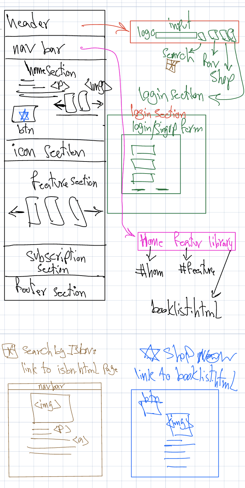
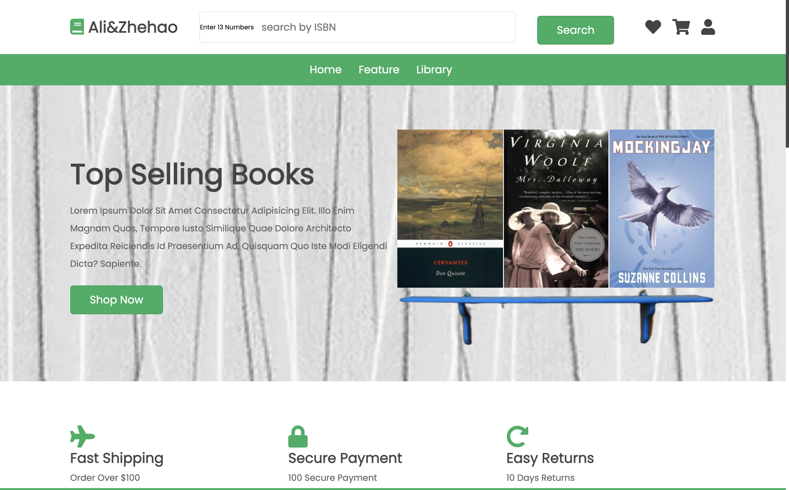
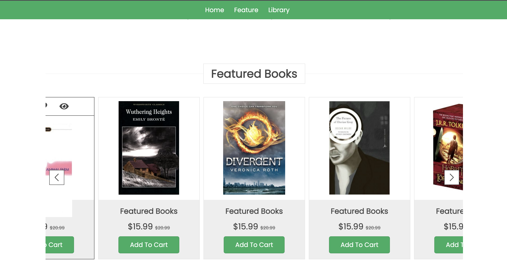
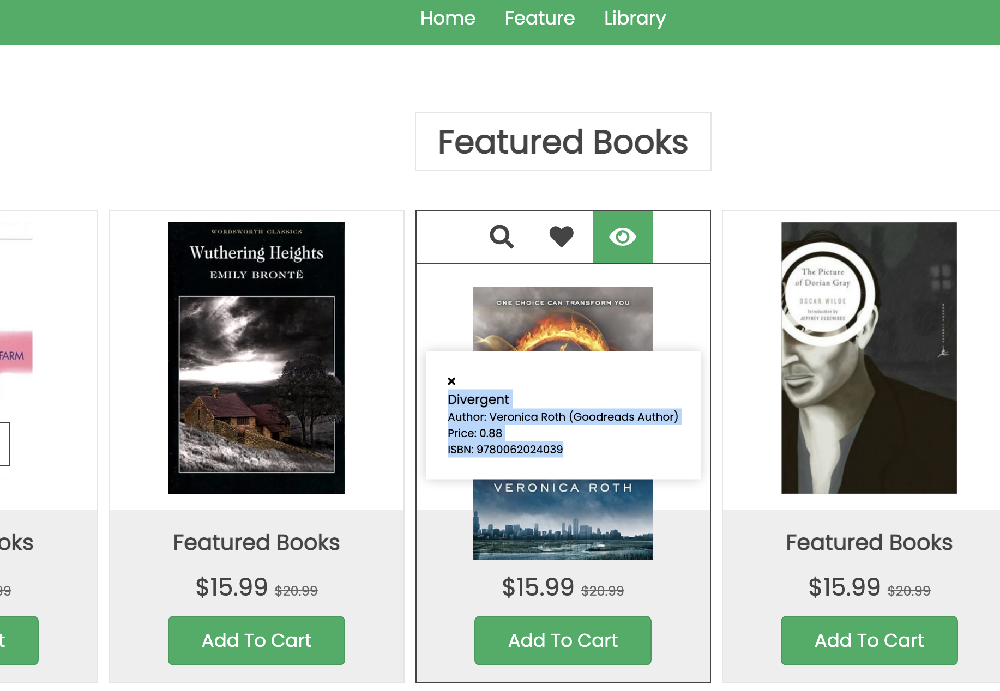
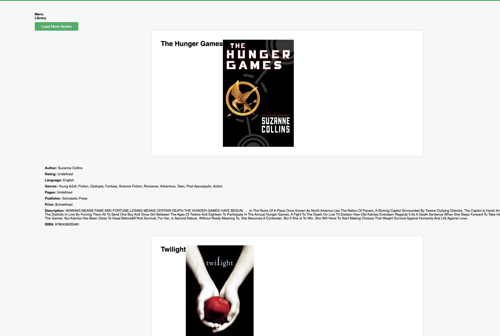
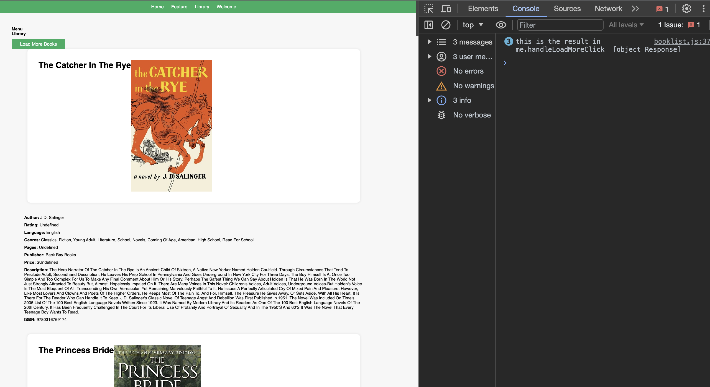
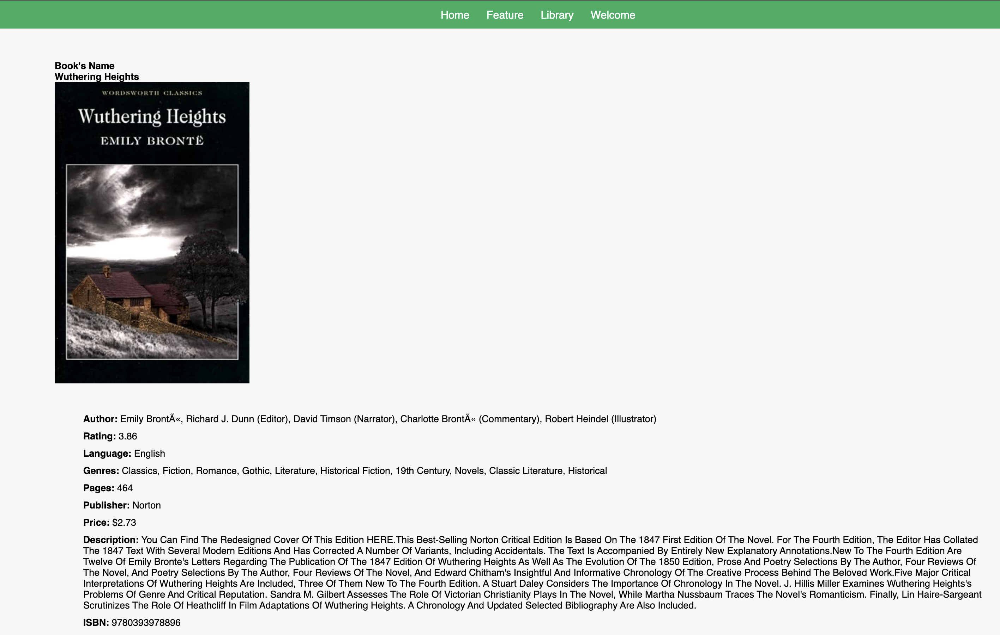
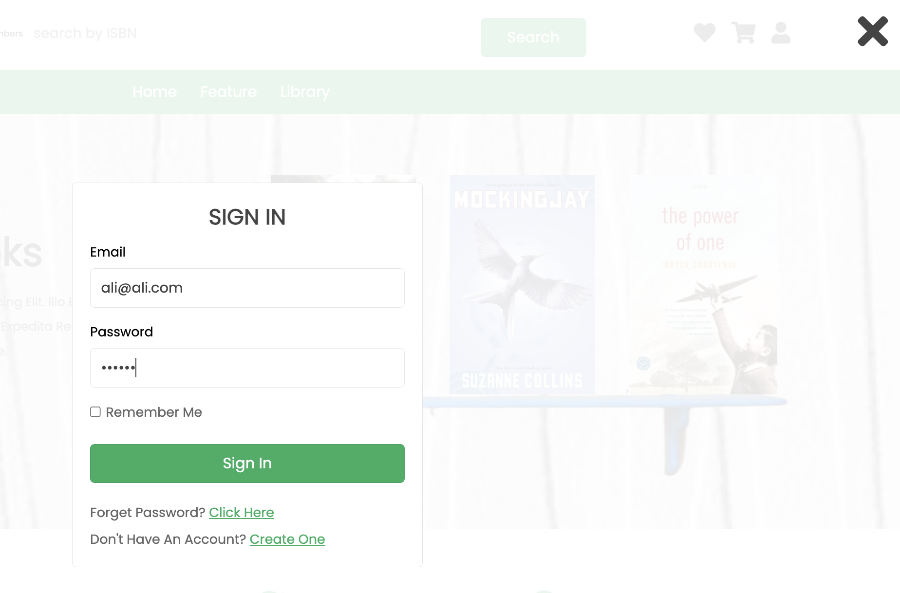
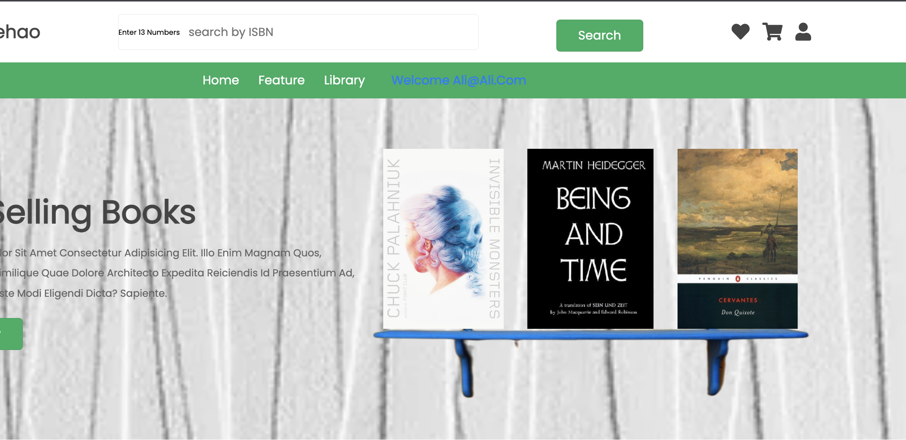

# E-commers_website

e-commers_website with Express, Node, MongoDB, js,html,css

## Authors

Ali, Zhehao

### Description:

This is a full-stack dynamic website project that provides various features related to books, user registration, and more. The project includes several components, such as the server-side code, HTML templates, and CSS styles.

## Design Document:



## Project Description:

Title: Online Bookstore Web Application

### Description:

Create an online bookstore web application that allows users to search for books by ISBN, view book details, and purchase books. The application also includes user authentication for account creation and login. Users can browse a collection of featured books, access book details, and make informed purchasing decisions.

## User Personas:

    ### Book Enthusiast - Sarah
        Age: 30
        Occupation: English Teacher
        Goals: Sarah loves reading books, especially classic literature. She wants a convenient way to search for and explore new and classic books online. She values detailed information about the books she's interested in.

    ### Student - Alex
        Age: 22
        Occupation: College Student
        Goals: Alex is a student who often needs to find textbooks for his courses. He's looking for an easy way to search for and purchase textbooks using their ISBN. He prefers quick and simple navigation.

    ### Frequent Shopper - Emily
        Age: 40
        Occupation: Marketing Manager
        Goals: Emily is an avid reader and frequently shops for books online. She seeks a user-friendly and secure platform where she can create an account, save her preferences, and enjoy a seamless shopping experience.

### User Stories:

    As a Book Enthusiast (Sarah), I want to search for a specific book by its ISBN so that I can find and explore classic literature easily.
        Scenario: Sarah visits the website, enters the ISBN of a classic book, and clicks the search button.
        Outcome: The system displays the book details, including the title, author, description, and cover image.

    As a Student (Alex), I want to quickly find and purchase textbooks by entering their ISBN.
        Scenario: Alex visits the website, enters the ISBN of his required textbook, and clicks the search button.
        Outcome: The system presents a list of matching textbooks, and Alex can choose the one he needs and proceed to purchase it.

    As a Frequent Shopper (Emily), I want to create an account and log in to access personalized features and make secure purchases.
        Scenario: Emily visits the website and clicks on the "Log In" button.
        Outcome: She's prompted to enter her email and password. After successfully logging in, Emily can access her account, view her purchase history, and update her personal information.

    As a User (Any Persona), I want to explore a collection of featured books.
        Scenario: A user visits the homepage and scrolls through a selection of featured books.
        Outcome: The user can click on a book to view its details or add it to their cart for purchase.

    As a User (Any Persona), I want to view detailed information about a book, including its author, price, and description.
        Scenario: A user clicks on a book from the search results or the featured books section.
        Outcome: The system displays a detailed page for the book, providing information on the author, price, description, and other relevant details.

## Project Components

### `MyDB.js`

The `MyDB.js` file contains a JavaScript module that connects to a MongoDB database. It includes functions for user management and book searching. The following functions are included:

- `getUser`: Fetches user information from the database.
- `createUser`: Inserts a new user into the database.
- `getSearch`: Searches for books based on provided criteria.
- `getBookByISBN`: Retrieves books by ISBN.

### `api.js`

The `api.js` file serves as the backend of the application using Express.js. It exposes several API endpoints for various functionalities, including:

- Book search with pagination.
- Book search by ISBN.
- User login and registration.

### `package.json`

The `package.json` file lists the project's dependencies and metadata. It includes details like the project name, version, description, author, and licensing information. It also includes dependencies for packages like `express`, `mongodb`, and `bcrypt`.

### `index.html`

The `index.html` file is the main HTML template for the website. It defines the structure of the website, including the header, navigation bar, featured books section, icons, and a newsletter subscription form. It uses external resources like Font Awesome and Swiper for additional styling and functionality.

### `booklist.html`

The `booklist.html` file is an HTML template for displaying a list of books. It includes a navigation bar and a book section. The books are loaded dynamically with a "Load More" button.

### `styles.css`

The `styles.css` file contains the CSS styles used in the project. It defines various styles for elements like headers, buttons, forms, icons, and more. It also uses custom properties for colors and layout.

### Key Objective

#Create a Web Application: The primary objective of this project is to create a web application that provides various features and functionalities to users.

## Search Books:

The project aims to allow users to search for books using different criteria such as ISBN and title. This search functionality provides users with easy access to book information.
#Display Book Information: Once a user searches for a book or views book details, the project should display comprehensive information about the book, including title, author, rating, language, genres, pages, publisher, price, and more.
#Pagination: The project includes pagination for search results, allowing users to navigate through multiple pages of book listings.

## Database Integration:

The project integrates with a MongoDB database for storing and retrieving user and book data. This includes user registration, login, and book information.

## Data Storage and Retrieval:

Data is stored and retrieved from the MongoDB database, and it should be done securely and efficiently.

## Responsive Design:

The frontend should have a responsive design to ensure a seamless experience on various devices and screen sizes.

## Screenshots:











## Run the project:

To run the project, make sure you have Node.js installed. You can start the server by running the following command after being the project folder:

```bash
npm install
nodemon index.js
```
